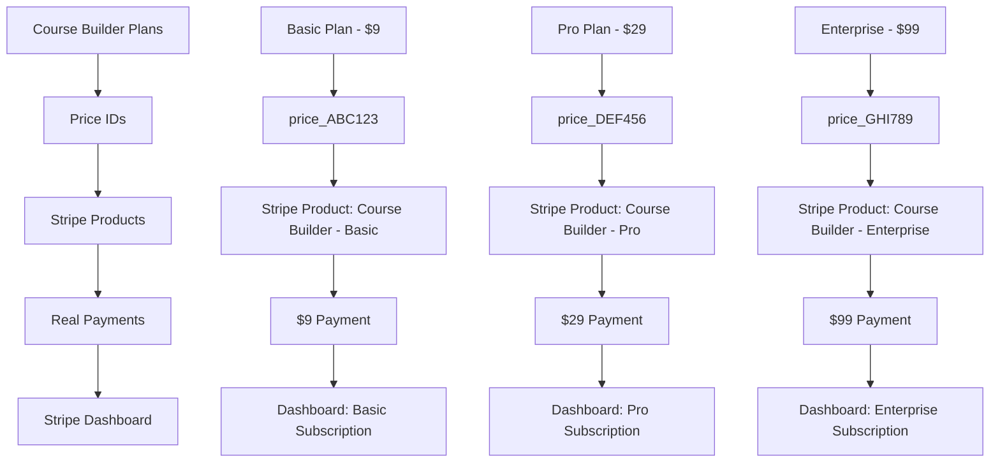

# 🔗 Course Builder ↔ Stripe Connection Flow

## 📊 **Visual Connection Diagram**



## 🔄 **Step-by-Step Flow**

### **1. Course Builder Plan Selection**
```
User clicks "Subscribe" on Pro Plan ($29)
↓
Course Builder looks up: plans.find(p => p.id === 'pro')
↓
Gets: stripePriceId: 'price_YOUR_PRO_PRICE_ID'
```

### **2. Stripe API Call**
```javascript
// Course Builder sends this to Stripe API:
stripe.checkout.sessions.create({
  line_items: [{
    price: 'price_YOUR_PRO_PRICE_ID', // ← Your real price ID
    quantity: 1
  }],
  mode: 'subscription',
  customer_email: 'user@example.com'
})
```

### **3. Stripe Checkout Page**
```
Stripe looks up price_YOUR_PRO_PRICE_ID
↓
Finds: "Course Builder - Pro Plan" product
↓
Shows: "$29.00 / month" checkout page
↓
User enters: 4242 4242 4242 4242
↓
Payment processed for your specific product
```

### **4. Stripe Dashboard Updates**
```
Payments → New payment: $29.00
Products → Course Builder - Pro Plan (+1 subscriber)
Customers → user@example.com (new customer)
Subscriptions → Active subscription to Pro Plan
Revenue → +$29.00 for your Pro product
```

### **5. Course Builder Updates**
```
Webhook/API response updates app:
↓
User subscription: 'pro'
Status: 'active'
Features: Pro plan features unlocked
Billing: Next payment in 30 days
```

## 🎯 **The Critical Connection Point**

### **Current State (Broken)**
```typescript
// In Course Builder (stripe.ts line 115)
stripePriceId: 'price_1234567890' // ← Fake placeholder ID
```

```
Course Builder → Stripe API call with fake ID
↓
Stripe: "Error: No such price: price_1234567890"
↓
Payment fails ❌
```

### **Fixed State (Working)**
```typescript
// In Course Builder (after you update)
stripePriceId: 'price_1ABC123DEF456' // ← Your real price ID from Stripe
```

```
Course Builder → Stripe API call with real ID
↓
Stripe: "Found: Course Builder - Pro Plan ($29)"
↓
Checkout page shows your product ✅
↓
Payment succeeds for YOUR product ✅
↓
Revenue appears in YOUR Stripe account ✅
```

## 🧪 **Testing the Connection**

### **Before Fix (What Happens Now)**
1. Click "Subscribe" in Course Builder
2. Stripe API call with `price_1234567890`
3. **Error**: "No such price" (because this ID doesn't exist)
4. **No payment**, **No billing**, **Nothing in Stripe Dashboard**

### **After Fix (What Will Happen)**
1. Click "Subscribe" in Course Builder
2. Stripe API call with `price_YOUR_REAL_ID`
3. **Success**: Redirects to Stripe checkout
4. **Real payment** for your actual product
5. **Billing appears** in your Stripe Dashboard
6. **Revenue tracking** for your specific products

## 📊 **Revenue Tracking Example**

Once connected properly, your Stripe Dashboard will show:

### **Products Revenue**
```
Course Builder - Basic Plan:    5 subscribers × $9  = $45/month
Course Builder - Pro Plan:     12 subscribers × $29 = $348/month
Course Builder - Enterprise:    2 subscribers × $99 = $198/month
Total Monthly Revenue:                                 $591/month
```

### **Individual Payments**
```
Dec 10: user1@example.com → Course Builder - Pro Plan → $29.00
Dec 10: user2@example.com → Course Builder - Basic Plan → $9.00
Dec 11: user3@example.com → Course Builder - Pro Plan → $29.00
```

### **Subscription Analytics**
```
Most Popular Plan: Pro Plan (63% of subscriptions)
Average Revenue Per User: $24.50
Churn Rate: 2.1%
Growth Rate: +15% MoM
```

## 🎯 **Summary**

**The Problem**: Course Builder has fake price IDs that don't exist in Stripe
**The Solution**: Create real Stripe products and update the price IDs in Course Builder
**The Result**: Real payments, real billing, real revenue tracking in your Stripe account

**🔗 Once you update the price IDs, every Course Builder subscription will create real revenue in your Stripe account that you can track, analyze, and manage!**
